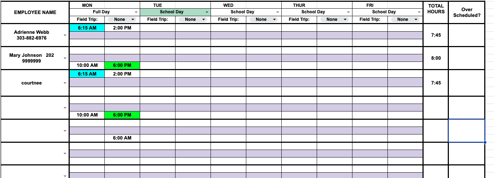

# Scheduling Workspace User Guide

## Who should use this guide
Site directors, scheduling coordinators, and substitute coordinators who must staff daycare classrooms without relying on live training. This guide walks through the workspace in the same order a user will experience it—setup, schedule building, validations, and publishing—with screenshots and practical reminders so each task can be completed independently.

## Overview of the workspace
- **Configuration panel (gear icon, top-right)**: add or remove employees, maintain certifications, and keep ratio requirements current. Every edit immediately feeds the validation engine, so no finding can be marked “addressed” manually; the violation disappears the instant the rule is satisfied.
- **Schedule Grid (calendar center)**: shows the selected week with segments, child counts, and staff assignments. Clock block windows display the operating hours guardrail overlay and highlight violations so staff can stay within open/close boundaries. Drag staff cards from the palette, drop them on segments, and log clock-in/clock-out times per block.
- **Staff Palette (right rail)**: displays each employee’s job title, certifications, availability windows, and recommended assignments. The palette highlights certified leaders to help you meet leader/child ratios.
- **Guided Status Tracker (left rail)**: enforces the Prepare → Assign → Review → Publish flow. Every step lists blockers; you cannot publish until all violations are cleared and any field-trip/substitute approvals finish.
- **Violation Navigator (bottom tray)**: lists unresolved policy violations with citations and metadata badges such as the “Operating hours guardrail.” Selecting an issue highlights the affected block or certification so you can fix the underlying data.

## Step 1: Configure employees, certifications, and ratio requirements
Every configuration change reruns validations immediately. Once a record satisfies the corresponding rule, its violation disappears—there are no “addressed” flags to toggle. Follow the sections below so the system can enforce guardrails before you build the schedule.

### Manage employees
1. Open the gear icon and select **People & Certifications**.
2. Create or update employees with job title, contact info, employment status (full time, part time, substitute), and working limits (`max_hours_per_day`, `max_hours_per_week`). These caps feed overtime and break checks, so keep them accurate for every payroll-eligible staff member.
3. Add availability windows so Auto-select and manual assignments respect the employee’s start/end preferences. Each window uses the same `HH:MM AM/PM` format you enter in the timeline.

### Record certifications
1. Within the same panel add certifications (CPR, First Aid, Medical Delegation, etc.) for each employee.
2. Enter issue and expiration dates; the compliance engine flags expired certifications instantly and surfaces them in the Violation Navigator so you can renew before Publish.
3. Attach policy notes, site-specific approvals, or renewal reminders in the certification notes field to provide context for auditors and substitutes.

### Maintain ratio requirements
1. Switch to the **Ratio Requirements** tab.
2. Create, edit, or remove ratio profiles by defining the `children_per_staff`, `leader_required` flag, `policy citation`, and whether the profile applies to in-house segments or field trips.
3. Reference the policy citation text so the violation message names the district rule, and pair it with the segment type to auto-populate guidance in the scheduler.
4. Save. Each change immediately re-triggers the guided tracker and Violation Navigator so you know when the new ratios are in compliance.

## Step 2: Build the week with clock blocks and guardrails
1. Choose the target week in the Schedule Grid. Copy a prior week if the routine repeats, or start fresh by entering child counts per day/segment (typed or imported from the roster). Every segment’s base child count helps the ratio engine compute minimum staff automatically.
2. Drag staff from the palette into each segment. You can add multiple non-contiguous blocks for the same employee on one day by dropping them into separate segments or by submitting another clock block—this mirrors split shifts, travel days, and staggered coverage without overwriting the first block.
3. Click or focus a block to edit the clock window, or open the **Add clock block** form:
   - Enter **Start** and **End** times in `HH:MM AM/PM` format. The form enforces `start < end`, clamps the child count to at least 1, and keeps the Save button disabled while required data is missing.
   - Operating hours appear above each timeline column; configured windows generate the green guardrail overlay so you can always see where schedules must fall. When no operating hours exist for that day, the column spells out “Operating hours not configured.”
   - If the block falls outside the operating window the red text `Clock block must stay within operating hours (7:00a–6:30p).` (times adjust to your configured window) appears and the form refuses to Save. The violation persists until you bring both start and end inside the guardrail.
   - Select or change the staff member (optional) and adjust the child count/segment as needed before saving. The timeline immediately renders the new block, complete with assigned staff, ratio summaries, and violation badges.
4. Use the **Auto-select** helper at the top of the timeline to get staffing suggestions. It considers leader requirements, certifications, recent availability windows, and the segments’ child counts so you spend less time hunting for qualified staff.
5. Field trips are marked per block. Choose the `Field Trip Type`, add required approvals, and the UI surfaces the adjusted ratio targets directly underneath the block so you can double-check compliance.

### Guardrail quick cues
- **Timeline badges** – Blocks flagged by the guardrail rule render a green “Operating hours guardrail” badge to keep the issue visible even when the navigator is collapsed.
- **Violation Navigator metadata** – Guardrail violations carry `operatingHoursId`, so the navigator adds the same badge and a “Jump to block” shortcut for fast edits.
- **Guided tracker icons** – Clock icons signal missing clock windows, badges show ratio gaps, and shields mark certification issues. Guardrail violations appear under the Review step until the timeline block, policy citation, and operating hour window agree.

## Step 3: Resolve validations and guided steps
- Open the **Violation Navigator** and click each issue to jump to the affected block, certification record, or ratio profile. Guardrail issues describe the `operatingHoursId` in their metadata, show the “Operating hours guardrail” badge, and explain which start/end times need to move inside the open-close window.
- You cannot mark a violation as “addressed.” Edit the relevant block, employee record, certification, or ratio so the data satisfies the rule; the navigator and guided tracker update the instant the violation clears.
- The **Guided Status Tracker** mirrors the navigator and enforces the Prepare → Assign → Review → Publish progression. Review stays blocked while guardrail, ratio, or certification violations are active; Publish remains disabled until approvals (field trips, substitutes) and outstanding errors are resolved.
- Use the **Status Tracker icons** (clock icon for missing clock entries, badge for unmet ratios, shield for certification gaps) to prioritize fixes, especially when guardrail violations appear under Review—they surface as “Live violation — edit the timeline to clear it.”

## Step 4: Publish and stay audit-ready
1. When no violations remain and the Publish step turns green, click **Publish schedule**. The system records who submitted the week and when, and sets the week’s status to `ready_for_review` or `submitted`.
2. Export the week (PDF/CSV toolbar buttons) for district records. The exports include every citation, violation snapshot, and the audit trail so you can prove compliance during reviews.
3. If you reopen a published week, validation reruns automatically. Make edits, confirm the violation list shrinks to zero, and republish once approvals stay green.

## Quick reference reminders
| Task | Notes | Where to find it |
| --- | --- | --- |
| Add/remove employees | Use the configuration gear → People & Certifications; updates run validations instantly. | Gear icon → People & Certifications |
| Update ratio/cert rules | Configure `children_per_staff`, leaders required, and citations for segments and field trips. | Gear icon → Ratio Requirements |
| Log clock-in/out times | Enter any `HH:MM AM/PM` within the operating hours. These times feed overtime/break rules. | Click block → Time entry |
| Create multi-block days | Drop the same staff onto multiple segments; each supports its own start/end time. | Schedule Grid block editor |
| Guardrail validations | The timeline overlay, the “Clock block must stay within operating hours…” message, and the violation badge keep each block inside the configured window. | Schedule Grid + Violation Navigator |
| Track violations | Violation Navigator bottom tray plus guided steps auto-block until resolved. | Violation tray + Status tracker |
| Export for audits | PDFs/CSVs include ratios, violations, and audit trail. | Schedule Grid toolbar |

## Need a refresher?
If you want to revisit the QA guardrails (QA-RULE-017 through QA-RULE-021, and the new timeline integrity catalog), open `docs/testing-approach.md` for the compliance matrix, automation plan, and the blockers you can expect while running the suites. Keep this guide handy so every schedule stays compliant even without a trainer.
